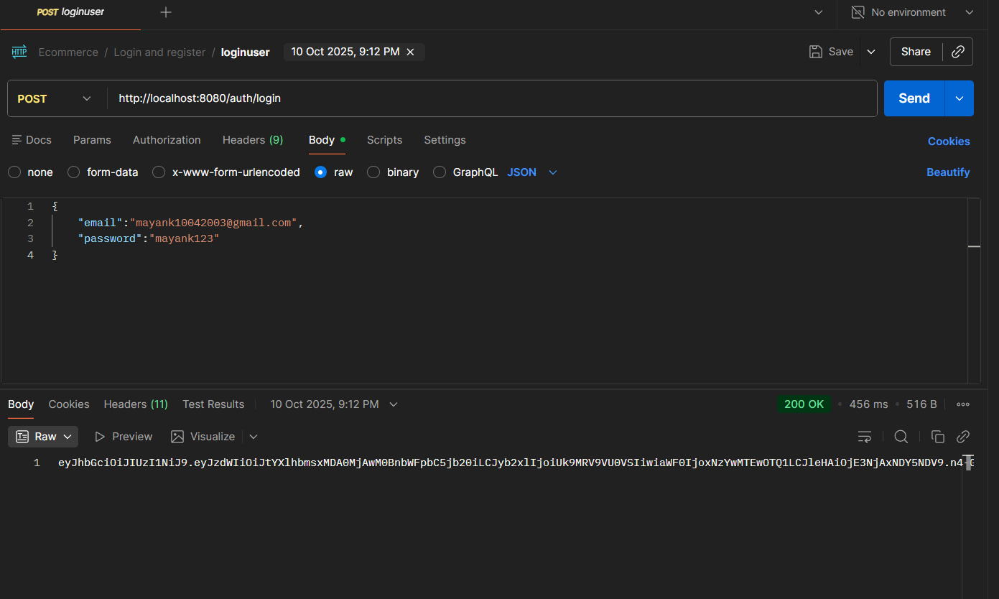
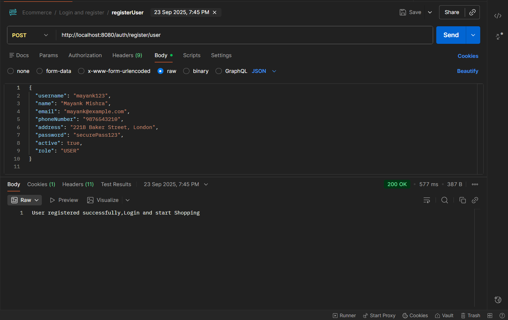
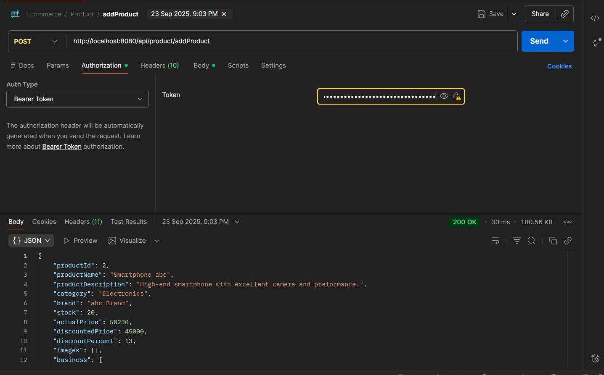
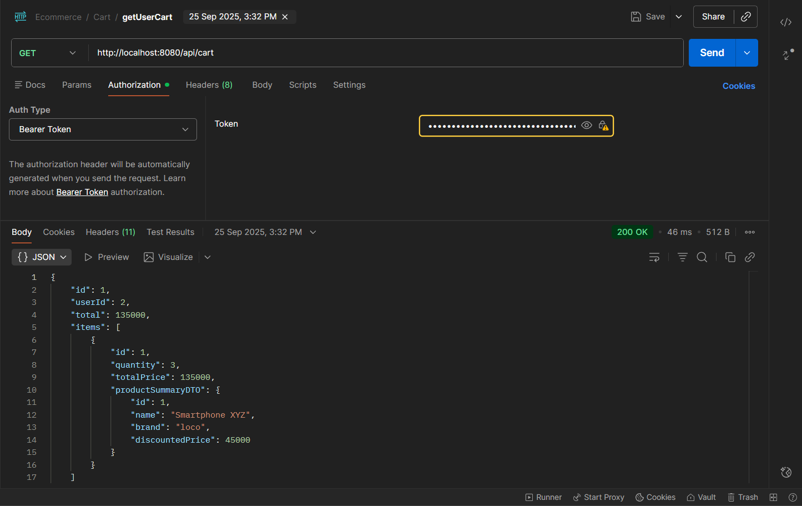
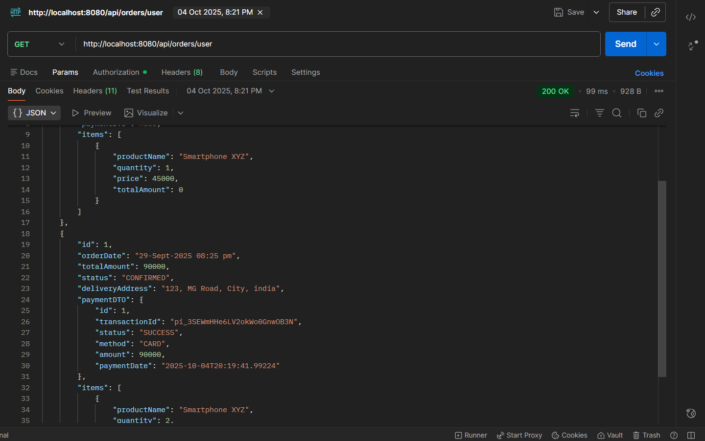
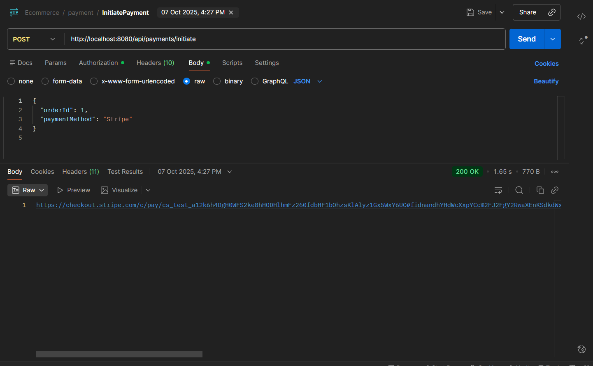
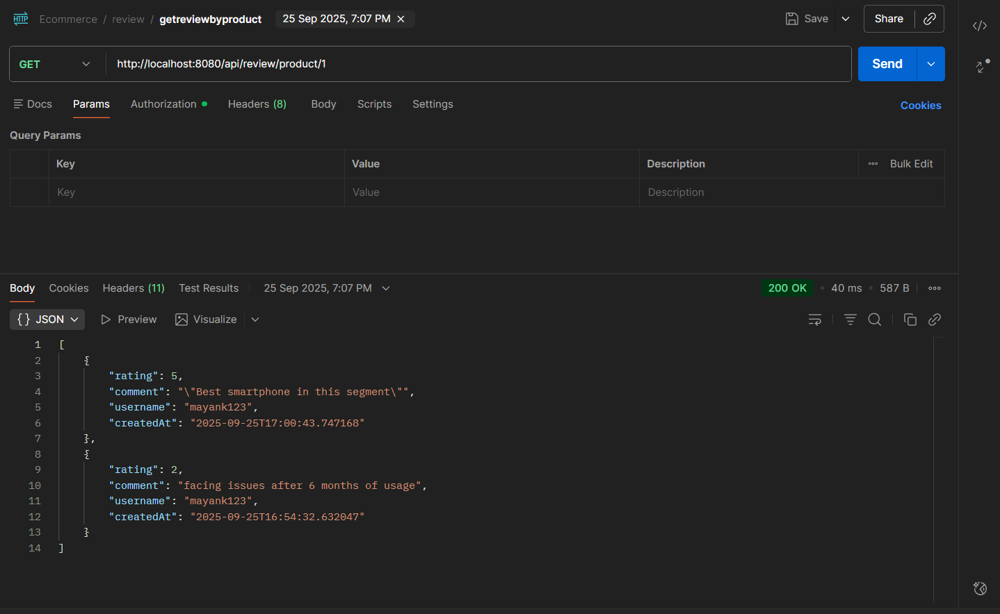

# EcommerceWeb — Spring Boot E-Commerce Backend

EcommerceWeb is a complete Spring Boot–based backend application for an e-commerce system.  
It provides modular APIs for Products, Orders, Payments, Cart, Users, and Authentication.

The project follows clean architecture, layered design, and modern Spring Boot best practices.

---

## Features

-  **Authentication & Authorization** (JWT-based) Using Spring Security.
-  User roles: Business / Customer
-  Product Management
-  Shopping Cart APIs
-  Order & Checkout APIs
- Stripe and Twilio APIs for payment and email confirmation
-  Global Exception Handling
-  Logs with Logback
-  Dockerfile + docker-compose for containerized running
- ️ Database: PostgreSQL, Redis Cache.
-  Unit and Integration Testing for APIs.
-  Clean folder structure using Controller → Service → Repository layers

---
## Tech Stacks
### Development
- **Java 21**
- **Spring Boot 3**
- **Spring Web (REST APIs)**
- **Spring Security (JWT Authentication)**
- **Spring Data JPA**
- **PostgreSQL**
- **Redis Cache**
- **Docker & Docker Compose**
- **Maven**

### Testing
- **JUnit 5**
- **Mockito**
- **Postman**

### Third-Party API Integrations
- **Stripe API** (Payments)
- **SendGrid API** (email)

## API Postman Test Images

###  Login API
After Successful Login A bearer Token is generated which should be used when using an api with roles as user.

###  Register User

### Add Product

### User Cart

### Order Details Of User

### Order Payment
Open the link in Browser add the test credentials and complete the payment.

### Place Order

### Product Review

